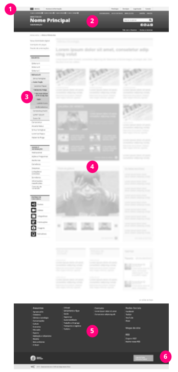
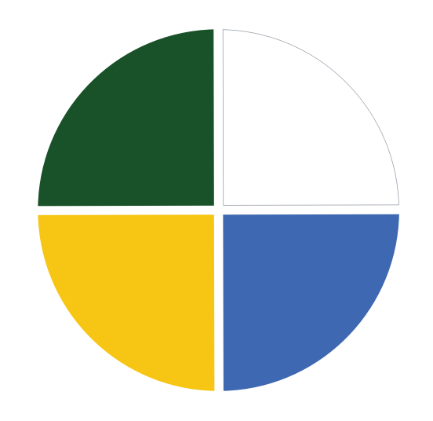
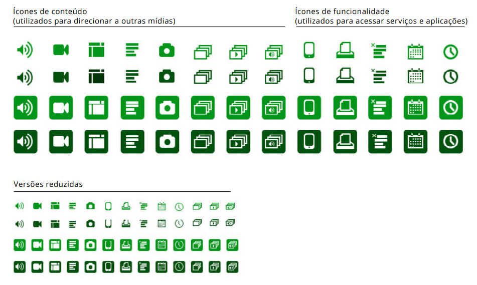

## 1. Introdução
   
   Usado em projetos de todos os tamanhos, mas principalmente grandes, visa reunir princípios e diretrizes através de uma documentação. É registrada as principais decisões de design, da maneira que não se perca e, que de fato sejam efetivas no processo de construção do produto em diferentes escopos/ambientes, como por exemplo as plataformas utilizadas.

## 2. Objetivos

  O principal objetivo dos guias de estilo é a comunicação entre as equipes de design e desenvolvimento do produto. Então, é de extrema importância que as decisões no guias de estilo estejam com facil acesso para consultas, e também esteja disponiveis para serem reutilizados em discussões sobre novas versões ou extensões relacionadas ao contexto, por exemplo **design de interface**. 

## 3. Considerações

  Um guia de estilo deve incorporar decisões de design envolvendo os principais elementos e considerações de design de interface. Marcus (1991) considera os seguintes elementos:

  • layout: proporção e grids; uso de metáforas espaciais; design gráfico de exibidores e ferramentas;
  • tipografia e seu uso em diálogos, formulários e relatórios;
  • simbolismo: clareza e consistência no design de ícones;
  • cores: os dez mandamentos sobre o uso de cores;
  • visualização de informação: design de gráficos, diagramas e mapas;
  • design de telas e elementos de interface (widgets);

## 4. Análise

Antes de realizar a análise do site da PM da Bahia e entender as mudanças necessárias, foi preciso entender o guia padrão de estilização e comunicação visual do governo. O modelo em questão se chama "Guia de Estilo do Portal Institucional Padrão" e trás um guia de estilo completo, mostrando como os sites institucionais devem se comportar em suas atividades, como o sites devem ser visualmente e padroniza sua identidade visual como um todo.

### 4.1 Grid

O grid é formado por dois grupos principais de colunas:

- **1** o grupo da esquerda, que conterá sempre o Coluna de Menus, com 150 pixels.
- **2** o grupo da direit, que receberá o conteúdo principal de cada página, tem 750 pixels.

 

  <figcaption class="center">Figura 1: Grid</figcaption>
    
  <figcaption class:"center">Fonte: Pág 15 do "Guia de Estilo do Portal Institucional Padrão" </figcaption>

 

### 4.2. Elementos principais

Os elementos principais de qualquer site baseado no portal padrão são os seguintes:

- **1** Barra padrão da comunicação digital do governo federal
- **2** Cabeçalho (header)
- **3** Coluna de menus
- **4** Miolo
- **5** Rodapé
- **6** Barra inferior da identidade padrão de comunicação digital do governo federal

 

  <figcaption class="center">Figura 2: estrutura do site</figcaption>
    
  <figcaption class:"center">Fonte: Pág 33 do "Guia de Estilo do Portal Institucional Padrão" </figcaption>

 

### 4.3 Tipografia

 

Para a apresentação de todo o conteúdo, somente duas fontes serão itilizadas. São elas:

 **Open Sans & Arial**

A decisao pela escolha das duas fontes foi tomada a fim de trazer armonia, padronização e conforto na leitura e acessibilidade.

### 4.4 Cores

Para apresentar a imagem do governo a partir de uma identidade única e fornecer maior articulação aos órgãos, foi desenvolvida uma paleta de cores derivadas de signos nacionais, tais como a bandeira nacional, os brasões, insígnias, entre outros.

 

  <figcaption class="center">Figura 3: cores</figcaption>
    
  <figcaption class:"center">Fonte: Pág 27 do "Guia de Estilo do Portal Institucional Padrão"</figcaption>

### 4.5 Ícones

Os pictorgramas auxiliam no entendimento do conteúdo e podem ser utilizados em conjunto com sua legenda ou sozinhos. Foi criado um repositório de ícones que pode ser reutilizado conforme a necessidade. Para casos nos quais não existam ícones pré-estabelecidos, os mesmos podem ser criados basenado-se na utilização de no máximo duas cores, na simplicidade e na manutenção de áreas de respiro, como presentes nos ícones a segir:

 

  <figcaption class="center">Figura 4: ícones</figcaption>
    
  <figcaption class:"center">Fonte: Pág 31 do "Guia de Estilo do Portal Institucional Padrão"</figcaption>

 

## 5. Referências
1. Barbosa, S.D.J.; Silva, B.S.; Silveira, M.S.; Gasparini, I.; Darin, T.; Barbosa, G.D.J. (2021) Interação Humano-Computador e Experiência do Usuário.

2. "Guia de Estilo do Portal Institucional Padrão", documento de acesso público através do endereço: https://www.gov.br/agricultura/pt-br/centrais-de-conteudo/manuais/guia-de-estilo-identidade-padrao-comunicacao-digital-idg.pdf 

## 6. Histórico de Versão

| Versão |  Data  |        Descrição        |     Autor(es)     | Revisor(es) |
|--------|--------|-------------------------|-------------------|-------------|
| 1.0    |  11/03/2022  | Criação do documento    |     Carlos Rafael e Herick Lima              | Carlos Rafael |
| 1.1    |  11/03/2022  | Introdução, objetivos e considerações    |     Carlos Rafael              | Herick Lima |
| 1.2    |  11/03/2022  | Análise e grid    |     Herick Lima      | Herick Lima |
| 1.3    |  11/03/2022  | Cores e ícones    |     Herick Lima      | Herick Lima |

